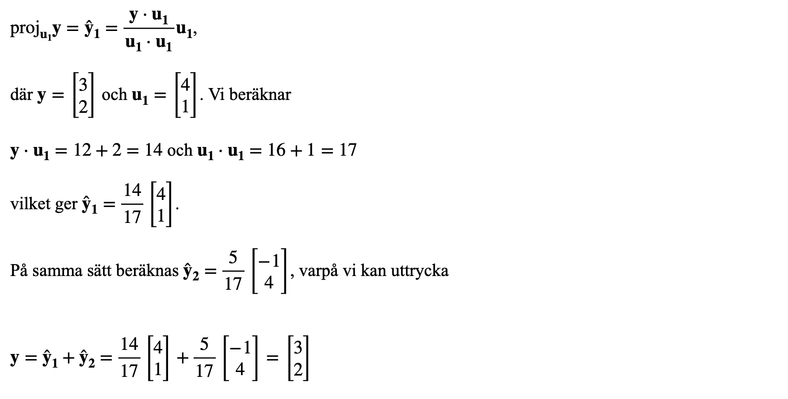

# Ortogonal projektion

Redan i kursen Fysik 1 har du komposantuppdelat krafer längs med koordinataxalarna. En begränsning med beräkningarna där var att koordinataxlarna skulle bygga upp det "vanliga" koordinatsystemet, dvs en horisontell x-axel och en vertikal y-axel.

I den linjära algebran så är koordinatsystemens möjligheter obegränsade. Axlarna behöver inte vara vinkelräta och de behöver inte peka horisontellt eller vertikalt. Vi ska titta på hur en och samma vektor projiceras på standardaxlarna respektive ett annat axelpar.


Den här uppgiften handlar om att beräkna projektionen för en vektor på godtyckliga koordinataxlar. Detta ska vi göra utifrån den s.k **skalärprodukten** av vektorer. Följande exempel bygger på den visade projektionen i figuren ovan.



Vi kom alltså tillbaka till samma vektor efter en utflykt med projektioner på andra koordinataxlar. Detta gäller alltid om de båda axlarna är vinkelräta.

## Uppgiften

Du ska skapa ett program där du anger en vektor, motsvarande y-vektorn i exemplet ovan, och två koordinataxlar som vektorer av typen `ndarray`. Programmet ska beräkna den ortogonala projektionen av vektorn y på respektive angiven koordinataxel.

### Test-exempel

*Kodskelettet nedan arbetar med samma data som räkneexemplet ovan.*

```python
import numpy as np

def calc_proj(vektor, koord_axlar):
    '''
    Parametrar:
        vektor: en vektor med två komponenter av typen ndarray
        koord_axlar: en matris som definierar de båda koordinat-
        axlarnas riktning i kolonnerna
    Returvärde:
        En matris som innehåller projektionen på respektive
        koordinataxel i kolonnerna
    '''
    result = np.zeros([2, 2])
    # Här sker själva beräkningen som lagrar
    # resultatet i variabeln result
    # ...
    return result

# Test-exempel
y = np.array([[3], [2]])
u1 = np.array([4, 1])
u2 = np.array([-1, 4])
u = np.array([u1.T, u2.T])
# Kontrollera hur y och u skrivs ut
# INNAN du börjar skriva funktionen

proj = calc_proj(y, u)
print(proj.round(2))
# För en fungerande funktion och givna
# data enligt räkneexemplet så skrivs ut:
# [[3.29, -0.29],
# [0.82, 1.18]]

print("Längden på ovanstående projektionsvektorer:")
norm_u1 = round(np.linalg.norm(proj[:, 0]), 2)
norm_u2 = round(np.linalg.norm(proj[:, 1]), 2)
print(f"||u1|| = {norm_u1}")  # Blir 3.4
print(f"||u2|| = {norm_u2}")  # Blir 1.21
 ```
